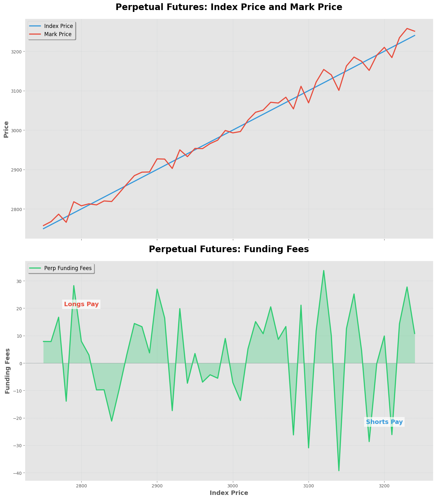
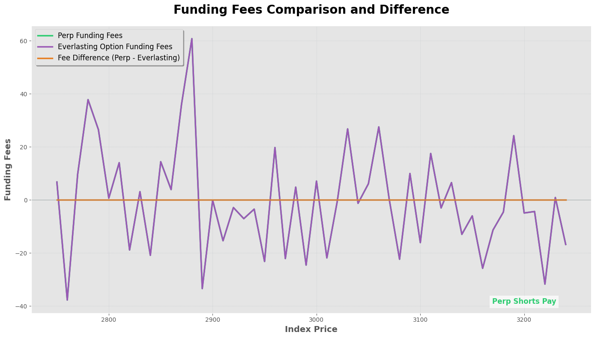
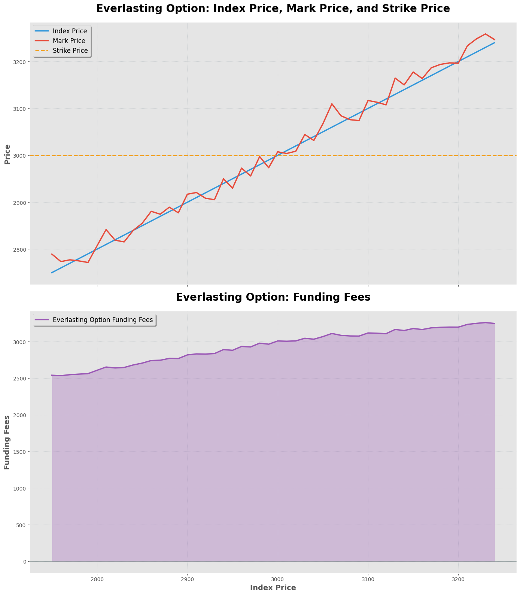
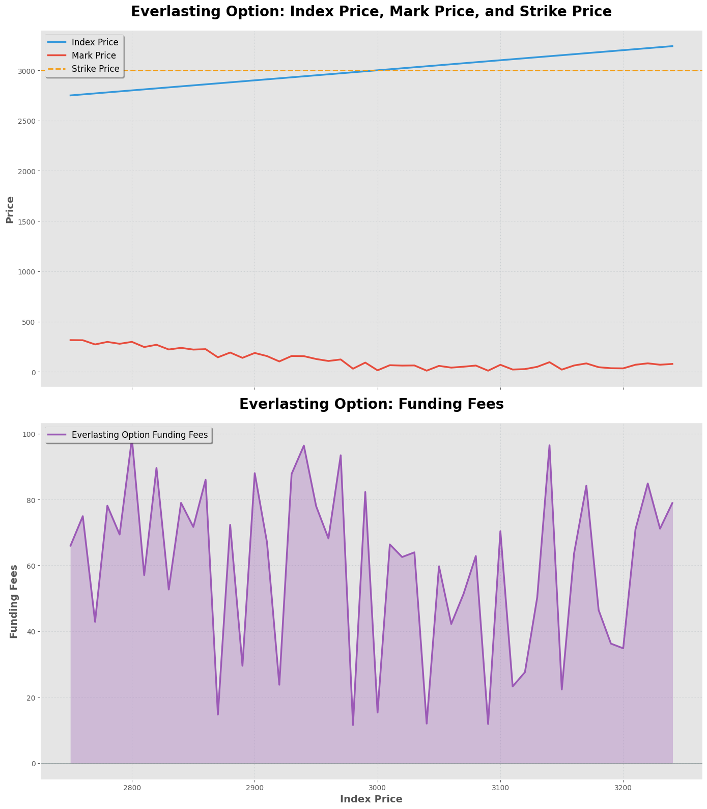

# Simplified perps

## A good definition first

Gives traders leveraged (multiplied for simple) exposure to an asset without needing to roll like traditional futures/options

## How to price perps?

- Value anytime is represented by mark price
- One rational assumption is, ignoring all factors, the underlying worth should be same as the asset's, which is represented by the market (or index) price
- The mechanism is somewhat like; as the mark price deviates from the underlying asset's index price, it will try to push it back to the index price
- The weapon used to mantain such equilibirum is called funding fee defined as _`mark_price - index_price`_
- When _`mark_price - index_price > 0`_ then those who are _long_ must pay to those who are _short_ and opposite when _`mark_price - index_price < 0`_
- Traders must also put down collateral, known as margin. When the mark price moves against the trader, the resulting losses are deducted from this margin. If the margin balance gets too low, the trader will be liquidated, meaning their position is automatically closed out.

### Here's a visualisation

_credits: claude 3.5_

## Everlasting options

They are the equivalent of perps for options

## How do they work?

- The mechanism is mostly similar, difference mainly lies in utility and pricing of funding fees
- Here funding fees is used to finance the position since it isn't traded against the market
- Funding fees are calculated as _`mark_price - payoff`_ where _`payoff = max(strike_price - current_price, 0)`_ for put option and _`payoff = max(current_price - strike_price, 0)`_ for a call option

### Interestingly, $0 Strike call = perp

### Some visualisations

If we use the same _`mark_price`_ from perp's simulation, we get something like this

If we simulate a seperate _`put_price`_ then we get this,

