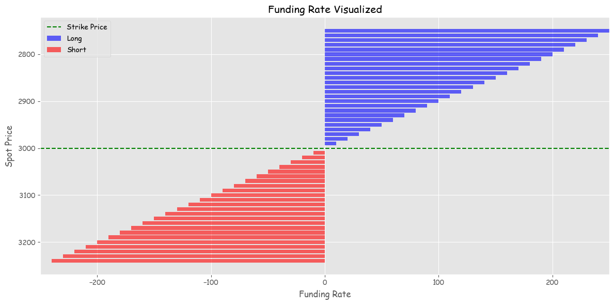

# Simplified perps

## A good definition first

Gives traders leveraged (multiplied for simple) exposure to an asset without needing to roll like traditional futures/options

## How to price perps?

- Value anytime is represented by mark price
- One rational assumption is, ignoring all factors, the underlying worth should be same as the asset's, which is represented by the market (or index) price
- The mechanism is somewhat like; as the mark price deviates from the underlying asset's index price, it will try to push it back to the index price
- The weapon used to mantain such equilibirum is called funding rate or fee defined as _`mark_price - index_price`_
- When _`mark_price - index_price > 0`_ then those who are _long_ must pay to those who are _short_ and opposite when _`mark_price - index_price < 0`_ 

### Here's a visualisation
_credits: claude 3.5_

